<div align="center">
	<h1>PyWal colorschemes</h1>
	<blockquote align="center">Collection of awesome color schemes for PyWal</blockquote>
	<p>
		<a href="https://github.com/ntk148v/wal-colorschemes/blob/master/LICENSE">
			
		</a>
		<a href="https://github.com/ntk148v/wal-colorschemes/stargazers">  </a>
		<br>
	</p><br>
</div>


- [Getting started](#getting-started)
- [Contributing](#contributing)
- [Preview](#preview)
	- [Melange light](#melange-light)
	- [Rose pine dawn](#rose-pine-dawn)
	- [Github light default](#github-light-default)
	- [Github light 2](#github-light-2)
	- [Github light](#github-light)
	- [Light decay](#light-decay)
	- [Alabaster](#alabaster)
	- [Xcodelighthc](#xcodelighthc)
	- [Xcodelight](#xcodelight)
	- [Ayu light](#ayu-light)
	- [One half light](#one-half-light)
	- [Github light modifed](#github-light-modifed)
	- [Github light colorblind](#github-light-colorblind)
	- [Tokyonight day](#tokyonight-day)
	- [Tokyonight night](#tokyonight-night)
	- [Tokyonight storm](#tokyonight-storm)
	- [Ayu mirage](#ayu-mirage)
	- [Neodark](#neodark)
	- [Japanesecity](#japanesecity)
	- [Decayce](#decayce)
	- [Decay](#decay)
	- [Kanagawa](#kanagawa)
	- [Dark decay](#dark-decay)
	- [Sonokai](#sonokai)
	- [Github dark default](#github-dark-default)
	- [Nightfly](#nightfly)
	- [Nord](#nord)
	- [Xcodewwdc](#xcodewwdc)
	- [Github dark dimmed](#github-dark-dimmed)
	- [Snazzy2](#snazzy2)
	- [Everblush](#everblush)
	- [Github dark](#github-dark)
	- [Spaceduck](#spaceduck)
	- [Horizon](#horizon)
	- [Juliana](#juliana)
	- [Snazzy](#snazzy)
	- [Iceberg](#iceberg)
	- [Palenight](#palenight)
	- [Melange dark](#melange-dark)
	- [Github dark high contrast](#github-dark-high-contrast)
	- [Badwolf](#badwolf)
	- [Urban](#urban)
	- [Ayu dark](#ayu-dark)
	- [Srcery](#srcery)
	- [Catppuccin](#catppuccin)
	- [Spacecamp](#spacecamp)
	- [Candid](#candid)
	- [Xcodedark](#xcodedark)
	- [Hackthebox](#hackthebox)
	- [Github dark colorblind](#github-dark-colorblind)
	- [One half dark](#one-half-dark)
	- [Darker monokai](#darker-monokai)
	- [Rose pine](#rose-pine)
	- [Xcodedarkhc](#xcodedarkhc)
	- [Moonfly](#moonfly)
	- [Rose pine moon](#rose-pine-moon)


## Getting started

- [PyWal](https://github.com/dylanaraps/pywal) is a tool to generate and change color-schemes on the fly.
- PyWal has a set of built-in color schemes. This repository aims to provide some more.
- [Install PyWal](https://github.com/dylanaraps/pywal/wiki/Installation)
- Copy [colorschemes](./colorschemes) to PyWal config directory.

```bash
$ cp -r colorschemes ~/.config/wal
```

- Validate & switch to new colorscheme

```bash
$ wal --theme
User Themes:
 - ayu-dark
 - ayu-light
 - badwolf
 - candid
 - catppuccin
 - darker-monokai
 - github-light
 - horizon
 - iceberg
 - kanagawa
 - ...

$ wal --theme <colorscheme>
```

## Contributing

Pull requests are the best way to propose changes to the codebase (we use
[Github Flow](https://guides.github.com/introduction/flow/index.html)). We actively welcome your pull requests:

- Fork the repo and create your branch from master.
- Make changes.
- Issue that pull request!

You may want to check out some scripts:
- [generate.py](./generate.py): Generate this README page.
- [convert_itermcolor.py](./convert_itermcolor.py): Convert .itermcolor to wal colorscheme file.
- [make-screenshots.sh](./make-screenshots.sh): Auto apply colors and capture screenshots.
- [preview-colors.sh](./preview-colors.sh): Preview colors in style.

## Preview

### Melange light

[Reference](https://github.com/savq/melange)

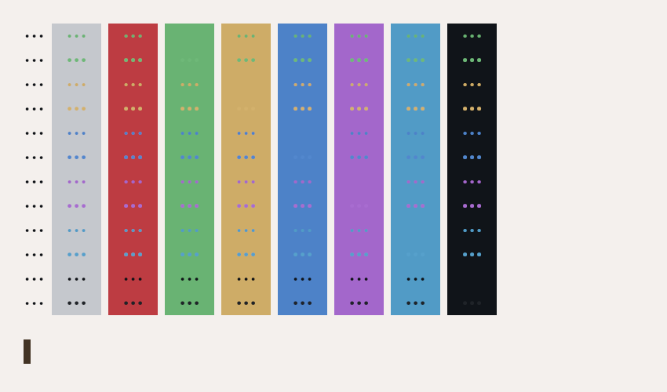

<details>
    <summary>Colors, click me</summary>

|  Color   |  Hex  |                               Preview                                |
|----------|:-----:|:--------------------------------------------------------------------:|
|background|#f4f0ed||
|cursor    |#423324||
|foreground|#423324||
|color0    |#423324||
|color1    |#d65c5c||
|color10   |#339933||
|color11   |#cc8033||
|color12   |#4d6eb3||
|color13   |#b34d90||
|color14   |#669999||
|color15   |#f7f2ed||
|color2    |#339933||
|color3    |#cc8033||
|color4    |#4d6eb3||
|color5    |#b34d90||
|color6    |#669999||
|color7    |#f7f2ed||
|color8    |#423324||
|color9    |#d65c5c||


</details>

### Rose pine dawn

[Reference](https://github.com/rose-pine)

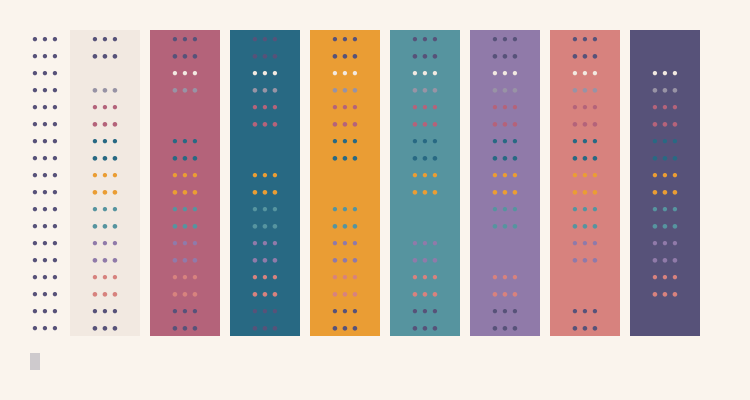

<details>
    <summary>Colors, click me</summary>

|  Color   |  Hex  |                               Preview                                |
|----------|:-----:|:--------------------------------------------------------------------:|
|background|#faf4ed||
|foreground|#575279||
|cursor    |#cecacd||
|color0    |#f2e9e1||
|color1    |#b4637a||
|color2    |#286983||
|color3    |#ea9d34||
|color4    |#56949f||
|color5    |#907aa9||
|color6    |#d7827e||
|color7    |#575279||
|color8    |#9893a5||
|color9    |#b4637a||
|color10   |#286983||
|color11   |#ea9d34||
|color12   |#56949f||
|color13   |#907aa9||
|color14   |#d7827e||
|color15   |#575279||


</details>

### Github light default

[Reference](https://github.com/projekt0n/github-nvim-theme)

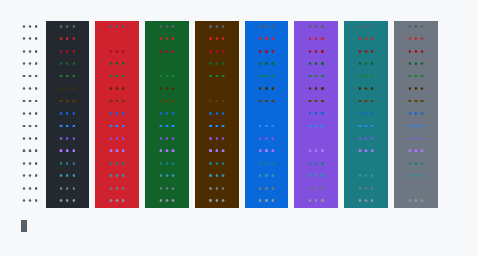

<details>
    <summary>Colors, click me</summary>

|  Color   |  Hex  |                               Preview                                |
|----------|:-----:|:--------------------------------------------------------------------:|
|background|#ffffff||
|cursor    |#034189||
|foreground|#24292f||
|color0    |#24292f||
|color1    |#cf212e||
|color10   |#1a7f36||
|color11   |#633b01||
|color12   |#218bff||
|color13   |#a475f9||
|color14   |#3192aa||
|color15   |#8c959f||
|color2    |#116329||
|color3    |#4d2c00||
|color4    |#0869da||
|color5    |#8250df||
|color6    |#1b7c83||
|color7    |#6e7781||
|color8    |#576069||
|color9    |#a40d26||


</details>

### Github light 2

[Reference](https://github.com/cdalvaro/github-vscode-theme-iterm)

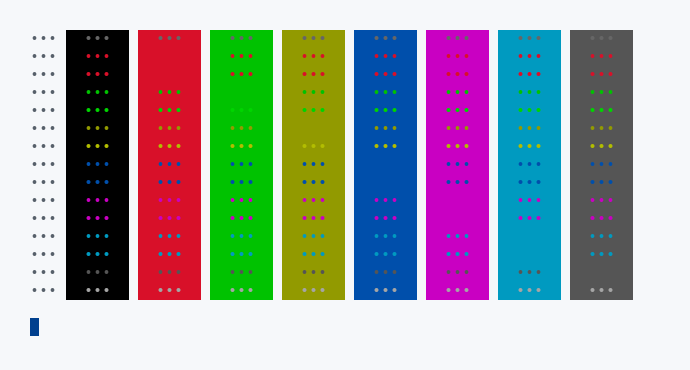

<details>
    <summary>Colors, click me</summary>

|  Color   |  Hex  |                               Preview                                |
|----------|:-----:|:--------------------------------------------------------------------:|
|background|#f6f8fa||
|cursor    |#00408e||
|foreground|#57606a||
|color0    |#000000||
|color1    |#d81029||
|color10   |#00d400||
|color11   |#b2bd00||
|color12   |#004fab||
|color13   |#c900c2||
|color14   |#009ac0||
|color15   |#a5a5a5||
|color2    |#00c200||
|color3    |#929a00||
|color4    |#004fab||
|color5    |#c900c2||
|color6    |#009ac0||
|color7    |#555555||
|color8    |#666666||
|color9    |#d81029||


</details>

### Github light

[Reference](https://github.com/projekt0n/github-nvim-theme)


<details>
    <summary>Colors, click me</summary>

|  Color   |  Hex  |                               Preview                                |
|----------|:-----:|:--------------------------------------------------------------------:|
|background|#ffffff||
|cursor    |#034189||
|foreground|#24292f||
|color0    |#24292e||
|color1    |#d73a49||
|color10   |#21863a||
|color11   |#b08800||
|color12   |#005cc5||
|color13   |#5a31a3||
|color14   |#3192aa||
|color15   |#d1d5da||
|color2    |#28a744||
|color3    |#dbab08||
|color4    |#0266d6||
|color5    |#5a31a3||
|color6    |#0598bc||
|color7    |#69737c||
|color8    |#959da5||
|color9    |#cb2431||


</details>

### Light decay

[Reference](https://github.com/decaycs/decay-terms)

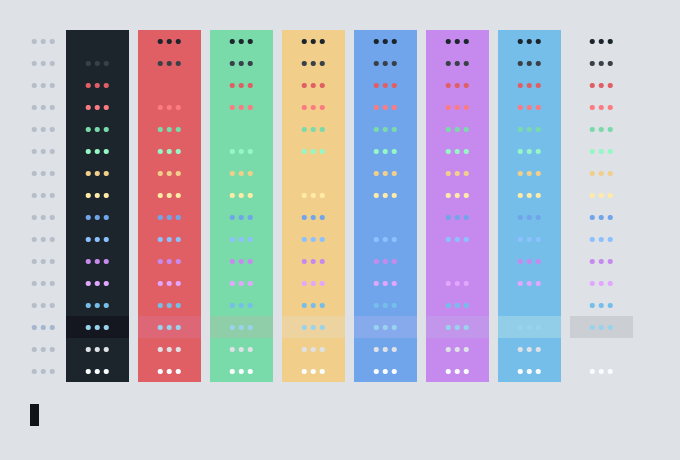

<details>
    <summary>Colors, click me</summary>

|  Color   |  Hex  |                               Preview                                |
|----------|:-----:|:--------------------------------------------------------------------:|
|background|#dee1e6||
|foreground|#101419||
|cursor    |#101419||
|color0    |#c5c8cd||
|color1    |#bd3c42||
|color2    |#69b373||
|color3    |#ceac67||
|color4    |#4d82c8||
|color5    |#a367cb||
|color6    |#519bc6||
|color7    |#101419||
|color8    |#989ba0||
|color9    |#c24147||
|color10   |#6eb878||
|color11   |#d3b16c||
|color12   |#5287cd||
|color13   |#a86cd0||
|color14   |#56a0cb||
|color15   |#1f2328||


</details>

### Alabaster

[Reference](https://github.com/tonsky/vscode-theme-alabaster)

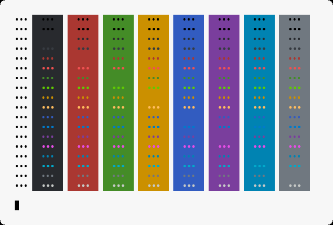

<details>
    <summary>Colors, click me</summary>

|  Color   |  Hex  |                               Preview                                |
|----------|:-----:|:--------------------------------------------------------------------:|
|background|#f7f7f7||
|foreground|#000000||
|cursor    |#000000||
|color0    |#282a2e||
|color1    |#aa3731||
|color2    |#448c27||
|color3    |#cb9000||
|color4    |#325cc0||
|color5    |#7a3e9d||
|color6    |#0083b2||
|color7    |#707880||
|color8    |#373b41||
|color9    |#f05050||
|color10   |#60cb00||
|color11   |#ffbc5d||
|color12   |#007acc||
|color13   |#e64ce6||
|color14   |#00aacb||
|color15   |#c5c8c6||


</details>

### Xcodelighthc

[Reference](https://github.com/arzg/vim-colors-xcode)

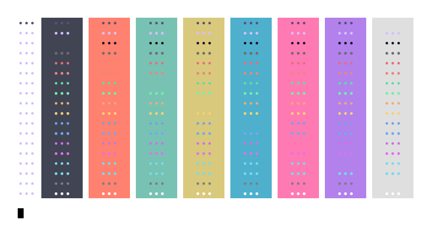

<details>
    <summary>Colors, click me</summary>

|  Color   |  Hex  |                               Preview                                |
|----------|:-----:|:--------------------------------------------------------------------:|
|background|#ffffff||
|cursor    |#000000||
|foreground|#000000||
|color0    |#b4d8fd||
|color1    |#ad1805||
|color10   |#174145||
|color11   |#78492a||
|color12   |#003f73||
|color13   |#9c2191||
|color14   |#441ea1||
|color15   |#000000||
|color2    |#355d61||
|color3    |#78492a||
|color4    |#0058a1||
|color5    |#9c2191||
|color6    |#703daa||
|color7    |#000000||
|color8    |#8a99a6||
|color9    |#ad1805||


</details>

### Xcodelight

[Reference](https://github.com/arzg/vim-colors-xcode)

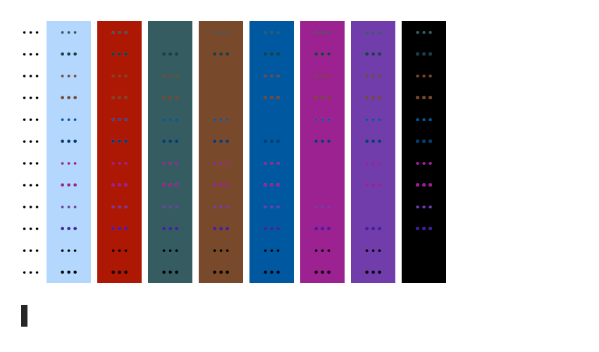

<details>
    <summary>Colors, click me</summary>

|  Color   |  Hex  |                               Preview                                |
|----------|:-----:|:--------------------------------------------------------------------:|
|background|#ffffff||
|cursor    |#262626||
|foreground|#262626||
|color0    |#b4d8fd||
|color1    |#d12f1b||
|color10   |#23575c||
|color11   |#78492a||
|color12   |#0b4f79||
|color13   |#ad3da4||
|color14   |#4b21b0||
|color15   |#262626||
|color2    |#3e8087||
|color3    |#78492a||
|color4    |#0f68a0||
|color5    |#ad3da4||
|color6    |#804fb8||
|color7    |#262626||
|color8    |#8a99a6||
|color9    |#d12f1b||


</details>

### Ayu light

[Reference](https://github.com/ayu-theme/ayu-colors)

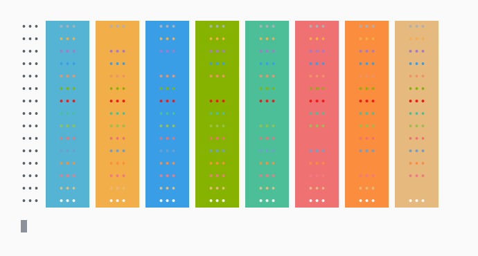

<details>
    <summary>Colors, click me</summary>

|  Color   |  Hex  |                               Preview                                |
|----------|:-----:|:--------------------------------------------------------------------:|
|background|#fafafa||
|foreground|#575f66||
|cursor    |#8a9199||
|color0    |#55b4d4||
|color1    |#f2ae49||
|color2    |#399ee6||
|color3    |#86b300||
|color4    |#4cbf99||
|color5    |#f07171||
|color6    |#fa8d3e||
|color7    |#e6ba7e||
|color8    |#abb0b6||
|color9    |#a37acc||
|color10   |#ed9366||
|color11   |#f51818||
|color12   |#99bf4d||
|color13   |#709ecc||
|color14   |#f27983||
|color15   |#f8f9fa||


</details>

### One half light

[Reference](https://github.com/sonph/onehalf)

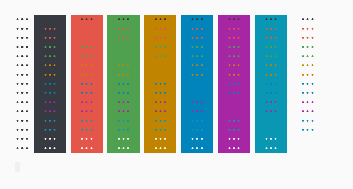

<details>
    <summary>Colors, click me</summary>

|  Color   |  Hex  |                               Preview                                |
|----------|:-----:|:--------------------------------------------------------------------:|
|background|#fafafa||
|foreground|#383a42||
|cursor    |#f0f0f0||
|color0    |#383a42||
|color1    |#e45649||
|color2    |#50a14f||
|color3    |#c18401||
|color4    |#0184bc||
|color5    |#a626a4||
|color6    |#0997b3||
|color7    |#fafafa||
|color8    |#383a42||
|color9    |#e45649||
|color10   |#50a14f||
|color11   |#c18401||
|color12   |#0184bc||
|color13   |#a626a4||
|color14   |#0997b3||
|color15   |#fafafa||


</details>

### Github light modifed

[Reference](https://github.com/projekt0n/github-nvim-theme)


<details>
    <summary>Colors, click me</summary>

|  Color   |  Hex  |                               Preview                                |
|----------|:-----:|:--------------------------------------------------------------------:|
|background|#f5eee6||
|cursor    |#034189||
|foreground|#24292f||
|color0    |#24292e||
|color1    |#d73a49||
|color10   |#21863a||
|color11   |#b08800||
|color12   |#005cc5||
|color13   |#5a31a3||
|color14   |#3192aa||
|color15   |#d1d5da||
|color2    |#28a744||
|color3    |#dbab08||
|color4    |#0266d6||
|color5    |#5a31a3||
|color6    |#0598bc||
|color7    |#69737c||
|color8    |#959da5||
|color9    |#cb2431||


</details>

### Github light colorblind

[Reference](https://github.com/projekt0n/github-nvim-theme)

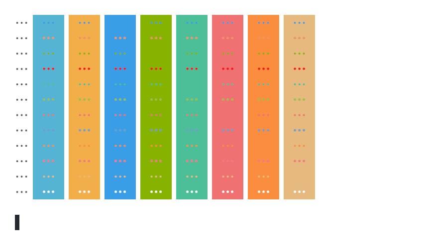

<details>
    <summary>Colors, click me</summary>

|  Color   |  Hex  |                               Preview                                |
|----------|:-----:|:--------------------------------------------------------------------:|
|background|#ffffff||
|cursor    |#0869da||
|foreground|#24292f||
|color0    |#24292f||
|color1    |#cf212e||
|color10   |#1a7f36||
|color11   |#633b01||
|color12   |#218bff||
|color13   |#a475f9||
|color14   |#3192aa||
|color15   |#8c959f||
|color2    |#116329||
|color3    |#4d2c00||
|color4    |#0869da||
|color5    |#8250df||
|color6    |#1b7c83||
|color7    |#6e7781||
|color8    |#576069||
|color9    |#a40d26||


</details>

### Tokyonight day

[Reference](https://github.com/folke/tokyonight.nvim)

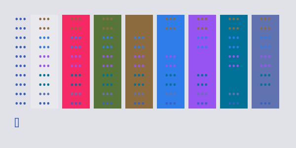

<details>
    <summary>Colors, click me</summary>

|  Color   |  Hex  |                               Preview                                |
|----------|:-----:|:--------------------------------------------------------------------:|
|background|#e1e2e7||
|foreground|#3760bf||
|cursor    |#3760bf||
|color0    |#e9e9ed||
|color1    |#f52a65||
|color2    |#587539||
|color3    |#8c6c3e||
|color4    |#2e7de9||
|color5    |#9854f1||
|color6    |#007197||
|color7    |#6172b0||
|color8    |#a1a6c5||
|color9    |#f52a65||
|color10   |#587539||
|color11   |#8c6c3e||
|color12   |#2e7de9||
|color13   |#9854f1||
|color14   |#007197||
|color15   |#3760bf||


</details>

### Tokyonight night

[Reference](https://github.com/folke/tokyonight.nvim)


<details>
    <summary>Colors, click me</summary>

|  Color   |  Hex  |                               Preview                                |
|----------|:-----:|:--------------------------------------------------------------------:|
|background|#1a1b26||
|foreground|#c0caf5||
|cursor    |#c0caf5||
|color0    |#15161e||
|color1    |#f7768e||
|color2    |#9ece6a||
|color3    |#e0af68||
|color4    |#7aa2f7||
|color5    |#bb9af7||
|color6    |#7dcfff||
|color7    |#a9b1d6||
|color8    |#414868||
|color9    |#f7768e||
|color10   |#9ece6a||
|color11   |#e0af68||
|color12   |#7aa2f7||
|color13   |#bb9af7||
|color14   |#7dcfff||
|color15   |#c0caf5||


</details>

### Tokyonight storm

[Reference](https://github.com/folke/tokyonight.nvim)

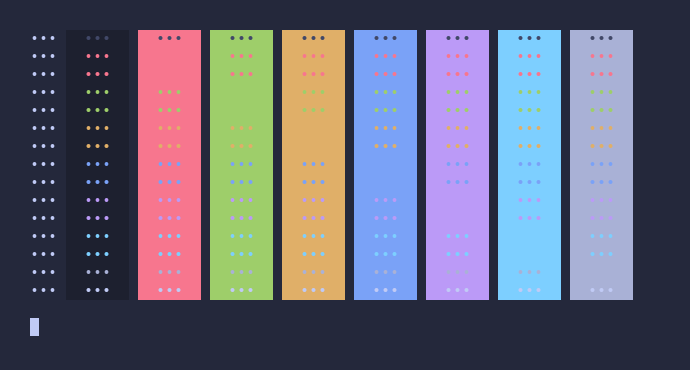

<details>
    <summary>Colors, click me</summary>

|  Color   |  Hex  |                               Preview                                |
|----------|:-----:|:--------------------------------------------------------------------:|
|background|#24283b||
|foreground|#c0caf5||
|cursor    |#c0caf5||
|color0    |#1d202f||
|color1    |#f7768e||
|color2    |#9ece6a||
|color3    |#e0af68||
|color4    |#7aa2f7||
|color5    |#bb9af7||
|color6    |#7dcfff||
|color7    |#a9b1d6||
|color8    |#414868||
|color9    |#f7768e||
|color10   |#9ece6a||
|color11   |#e0af68||
|color12   |#7aa2f7||
|color13   |#bb9af7||
|color14   |#7dcfff||
|color15   |#c0caf5||


</details>

### Ayu mirage

[Reference](https://github.com/dempfi/ayu)


<details>
    <summary>Colors, click me</summary>

|  Color   |  Hex  |                               Preview                                |
|----------|:-----:|:--------------------------------------------------------------------:|
|background|#1f2430||
|cursor    |#ffcc66||
|foreground|#cbccc6||
|color0    |#1a1e29||
|color1    |#f28779||
|color2    |#bae67e||
|color3    |#ffd580||
|color4    |#73d0ff||
|color5    |#d4bfff||
|color6    |#95e6cb||
|color7    |#c7c7c7||
|color8    |#686868||
|color9    |#f28779||
|color10   |#bae67e||
|color11   |#ffd580||
|color12   |#73d0ff||
|color13   |#d4bfff||
|color14   |#95e6cb||
|color15   |#ffffff||


</details>

### Neodark

[Reference](https://github.com/KeitaNakamura/neodark.vim)

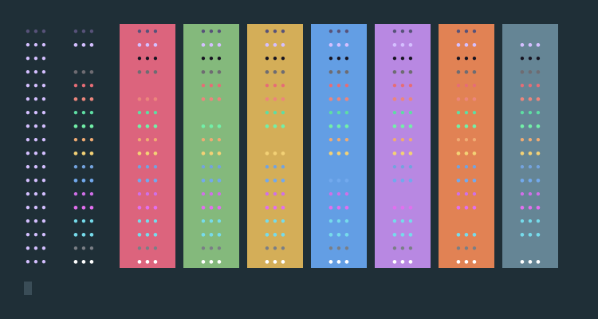

<details>
    <summary>Colors, click me</summary>

|  Color   |  Hex  |                               Preview                                |
|----------|:-----:|:--------------------------------------------------------------------:|
|background|#1f2f37||
|cursor    |#3a4d57||
|foreground|#aabac4||
|color0    |#1f2f37||
|color1    |#dc647d||
|color10   |#4bb1a7||
|color11   |#c99720||
|color12   |#72c7d1||
|color13   |#475c69||
|color14   |#ae8785||
|color15   |#aabbc4||
|color2    |#84b97c||
|color3    |#d4ae58||
|color4    |#639ee4||
|color5    |#b888e2||
|color6    |#e18254||
|color7    |#658595||
|color8    |#263a45||
|color9    |#e69ca0||


</details>

### Japanesecity

[Reference](https://github.com/mmsaeed509/bspwm-dots/blob/master/config/bspwm/colorschemes/japanesecity)

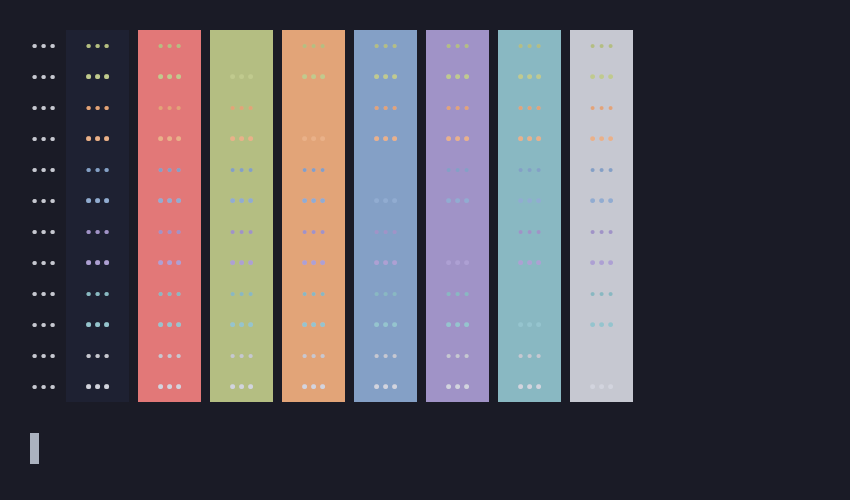

<details>
    <summary>Colors, click me</summary>

|  Color   |  Hex  |                               Preview                                |
|----------|:-----:|:--------------------------------------------------------------------:|
|background|#1a1b26||
|foreground|#d4bfff||
|cursor    |#abb2bf||
|color0    |#171421||
|color1    |#e66d76||
|color2    |#5edea3||
|color3    |#efab73||
|color4    |#73a3de||
|color5    |#d06fe8||
|color6    |#75dbeb||
|color7    |#7a7e85||
|color8    |#6e6c72||
|color9    |#eb867c||
|color10   |#72f0a8||
|color11   |#f3d175||
|color12   |#72a9ed||
|color13   |#e26fef||
|color14   |#76dbeb||
|color15   |#ffffff||


</details>

### Decayce

[Reference](https://github.com/decaycs/decay-terms)

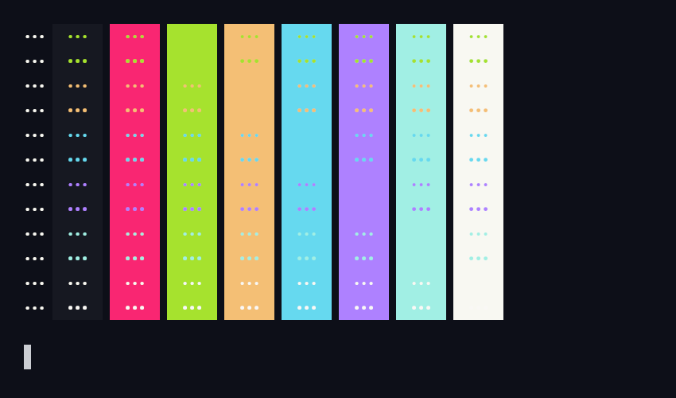

<details>
    <summary>Colors, click me</summary>

|  Color   |  Hex  |                               Preview                                |
|----------|:-----:|:--------------------------------------------------------------------:|
|background|#0d0f18||
|foreground|#a5b6cf||
|cursor    |#cbced3||
|color0    |#151720||
|color1    |#dd6777||
|color2    |#90ceaa||
|color3    |#ecd3a0||
|color4    |#86aaec||
|color5    |#c296eb||
|color6    |#93cee9||
|color7    |#cbced3||
|color8    |#1c1e27||
|color9    |#e26c7c||
|color10   |#95d3af||
|color11   |#f1d8a5||
|color12   |#8baff1||
|color13   |#c79bf0||
|color14   |#98d3ee||
|color15   |#d0d3d8||


</details>

### Decay

[Reference](https://github.com/decaycs/decay-terms)

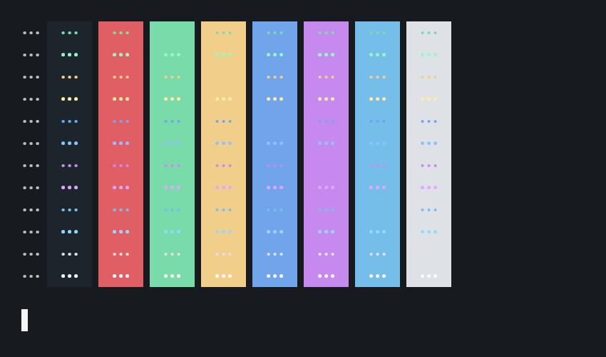

<details>
    <summary>Colors, click me</summary>

|  Color   |  Hex  |                               Preview                                |
|----------|:-----:|:--------------------------------------------------------------------:|
|background|#171a1f||
|foreground|#b6beca||
|cursor    |#f5f5f5||
|color0    |#1c252c||
|color1    |#e05f65||
|color2    |#78dba9||
|color3    |#f1cf8a||
|color4    |#70a5eb||
|color5    |#c68aee||
|color6    |#74bee9||
|color7    |#dee1e6||
|color8    |#384148||
|color9    |#fc7b81||
|color10   |#94f7c5||
|color11   |#ffeba6||
|color12   |#8cc1ff||
|color13   |#e2a6ff||
|color14   |#90daff||
|color15   |#fafdff||


</details>

### Kanagawa

[Reference](https://github.com/rebelot/kanagawa.nvim)

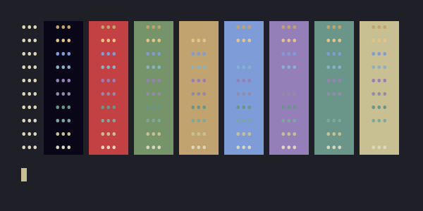

<details>
    <summary>Colors, click me</summary>

|  Color   |  Hex  |                               Preview                                |
|----------|:-----:|:--------------------------------------------------------------------:|
|foreground|#dcd7ba||
|background|#1f1f28||
|cursor    |#c8c093||
|color0    |#090618||
|color1    |#c34043||
|color2    |#76946a||
|color3    |#c0a36e||
|color4    |#7e9cd8||
|color5    |#957fb8||
|color6    |#6a9589||
|color7    |#c8c093||
|color8    |#727169||
|color9    |#e82424||
|color10   |#98bb6c||
|color11   |#e6c384||
|color12   |#7fb4ca||
|color13   |#938aa9||
|color14   |#7aa89f||
|color15   |#dcd7ba||
|color16   |#ffa066||
|color17   |#ff5d62||


</details>

### Dark decay

[Reference](https://github.com/decaycs/decay-terms)

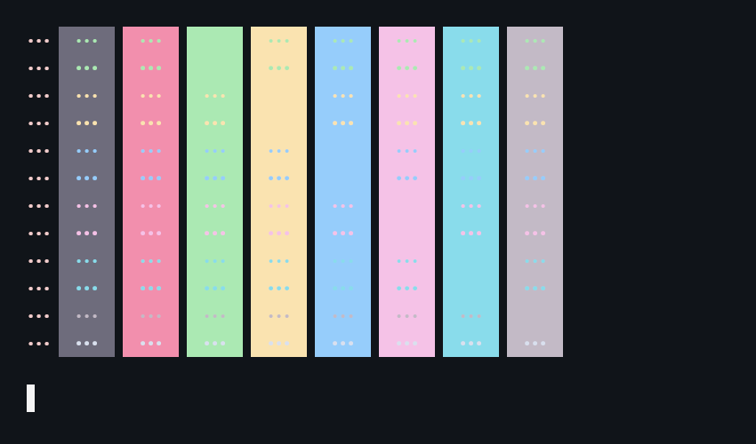

<details>
    <summary>Colors, click me</summary>

|  Color   |  Hex  |                               Preview                                |
|----------|:-----:|:--------------------------------------------------------------------:|
|background|#101419||
|foreground|#b6beca||
|cursor    |#f5f5f5||
|color0    |#1c252c||
|color1    |#e05f65||
|color2    |#78dba9||
|color3    |#f1cf8a||
|color4    |#70a5eb||
|color5    |#c68aee||
|color6    |#74bee9||
|color7    |#dee1e6||
|color8    |#384148||
|color9    |#fc7b81||
|color10   |#94f7c5||
|color11   |#ffeba6||
|color12   |#8cc1ff||
|color13   |#e2a6ff||
|color14   |#90daff||
|color15   |#fafdff||


</details>

### Sonokai

[Reference](https://github.com/sainnhe/sonokai)

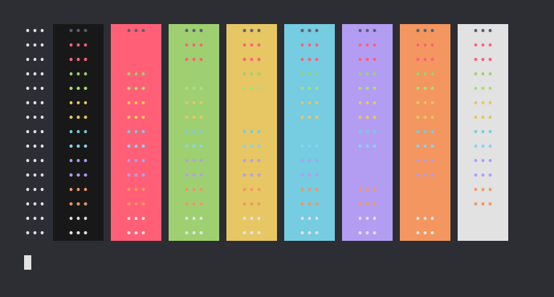

<details>
    <summary>Colors, click me</summary>

|  Color   |  Hex  |                               Preview                                |
|----------|:-----:|:--------------------------------------------------------------------:|
|background|#2c2e34||
|foreground|#e2e2e3||
|cursor    |#e2e2e3||
|color0    |#181819||
|color1    |#ff6077||
|color2    |#9ed072||
|color3    |#e7c664||
|color4    |#76cce0||
|color5    |#b39df3||
|color6    |#f39660||
|color7    |#e2e2e3||
|color8    |#595f6f||
|color9    |#ff6077||
|color10   |#a7df78||
|color11   |#e7c664||
|color12   |#85d3f2||
|color13   |#b39df3||
|color14   |#f39660||
|color15   |#e2e2e3||


</details>

### Github dark default

[Reference](https://github.com/projekt0n/github-nvim-theme)


<details>
    <summary>Colors, click me</summary>

|  Color   |  Hex  |                               Preview                                |
|----------|:-----:|:--------------------------------------------------------------------:|
|background|#0c1116||
|cursor    |#73b7f2||
|foreground|#c9d1d9||
|color0    |#484f58||
|color1    |#ff7b72||
|color10   |#55d363||
|color11   |#e3b341||
|color12   |#79c0ff||
|color13   |#d2a8ff||
|color14   |#55d4dd||
|color15   |#f0f6fc||
|color2    |#3fb950||
|color3    |#d29921||
|color4    |#58a6ff||
|color5    |#bc8cff||
|color6    |#39c5cf||
|color7    |#b1bac4||
|color8    |#6e7681||
|color9    |#ffa198||


</details>

### Nightfly

[Reference](https://github.com/bluz71/vim-nightfly-guicolors)

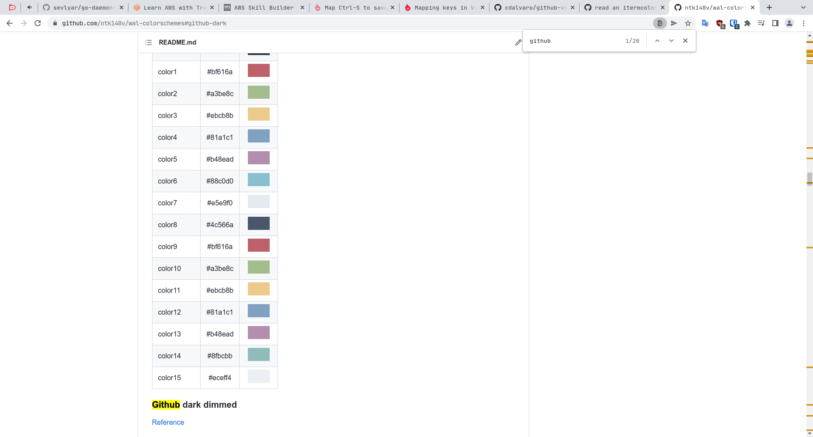

<details>
    <summary>Colors, click me</summary>

|  Color   |  Hex  |                               Preview                                |
|----------|:-----:|:--------------------------------------------------------------------:|
|background|#011627||
|foreground|#acb4c2||
|cursor    |#acb4c2||
|color0    |#1d3b53||
|color1    |#fc514e||
|color2    |#a1cd5e||
|color3    |#e3d18a||
|color4    |#82aaff||
|color5    |#c792ea||
|color6    |#7fdbca||
|color7    |#a1aab8||
|color8    |#7c8f8f||
|color9    |#ff5874||
|color10   |#21c7a8||
|color11   |#ecc48d||
|color12   |#82aaff||
|color13   |#ae81ff||
|color14   |#7fdbca||
|color15   |#d6deeb||


</details>

### Nord

[Reference](https://github.com/arcticicestudio/nord)

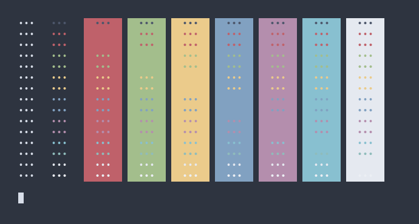

<details>
    <summary>Colors, click me</summary>

|  Color   |  Hex  |                               Preview                                |
|----------|:-----:|:--------------------------------------------------------------------:|
|background|#2e3440||
|foreground|#d8dee9||
|cursor    |#d8dee9||
|color0    |#2e3440||
|color1    |#bf616a||
|color2    |#a3be8c||
|color3    |#ebcb8b||
|color4    |#81a1c1||
|color5    |#b48ead||
|color6    |#88c0d0||
|color7    |#e5e9f0||
|color8    |#4c566a||
|color9    |#bf616a||
|color10   |#a3be8c||
|color11   |#ebcb8b||
|color12   |#81a1c1||
|color13   |#b48ead||
|color14   |#8fbcbb||
|color15   |#eceff4||


</details>

### Xcodewwdc

[Reference](https://github.com/arzg/vim-colors-xcode)


<details>
    <summary>Colors, click me</summary>

|  Color   |  Hex  |                               Preview                                |
|----------|:-----:|:--------------------------------------------------------------------:|
|background|#292c36||
|cursor    |#e7e8eb||
|foreground|#e7e8eb||
|color0    |#494d5c||
|color1    |#bb383a||
|color10   |#94c66e||
|color11   |#d28e5d||
|color12   |#8884c5||
|color13   |#b73999||
|color14   |#00aba4||
|color15   |#e7e8eb||
|color2    |#94c66e||
|color3    |#d28e5d||
|color4    |#8884c5||
|color5    |#b73999||
|color6    |#00aba4||
|color7    |#e7e8eb||
|color8    |#7f869e||
|color9    |#bb383a||


</details>

### Github dark dimmed

[Reference](https://github.com/projekt0n/github-nvim-theme)

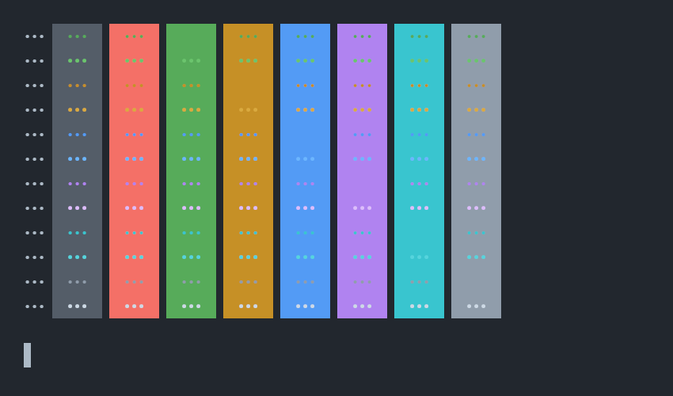

<details>
    <summary>Colors, click me</summary>

|  Color   |  Hex  |                               Preview                                |
|----------|:-----:|:--------------------------------------------------------------------:|
|background|#21262e||
|cursor    |#6cb6ff||
|foreground|#adbac7||
|color0    |#535d68||
|color1    |#f47067||
|color10   |#6bc46c||
|color11   |#daaa3f||
|color12   |#6cb6ff||
|color13   |#dcbdfb||
|color14   |#55d4dd||
|color15   |#cdd9e5||
|color2    |#57ab5a||
|color3    |#c69026||
|color4    |#539bf5||
|color5    |#b083f0||
|color6    |#39c5cf||
|color7    |#909dab||
|color8    |#636e7b||
|color9    |#ff938a||


</details>

### Snazzy2

[Reference](https://github.com/connorholyday/vim-snazzy)

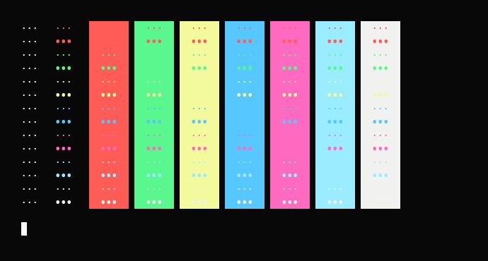

<details>
    <summary>Colors, click me</summary>

|  Color   |  Hex  |                               Preview                                |
|----------|:-----:|:--------------------------------------------------------------------:|
|background|#080808||
|foreground|#f9f9f9||
|cursor    |#f9f9ff||
|color0    |#080808||
|color1    |#ff5c57||
|color2    |#5af78e||
|color3    |#f3f99d||
|color4    |#57c7ff||
|color5    |#ff6ac1||
|color6    |#9aedfe||
|color7    |#f1f1f0||
|color8    |#43454f||
|color9    |#ff5c57||
|color10   |#5af78e||
|color11   |#f3f99d||
|color12   |#57c7ff||
|color13   |#ff6ac1||
|color14   |#9aedfe||
|color15   |#eff0eb||


</details>

### Everblush

[Reference](https://github.com/Everblush)

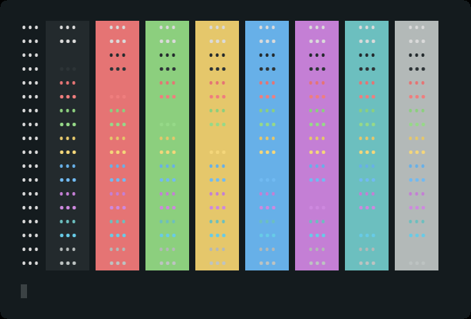

<details>
    <summary>Colors, click me</summary>

|  Color   |  Hex  |                               Preview                                |
|----------|:-----:|:--------------------------------------------------------------------:|
|background|#141b1e||
|foreground|#dadada||
|cursor    |#3b4244||
|color0    |#232a2d||
|color1    |#e57474||
|color2    |#8ccf7e||
|color3    |#e5c76b||
|color4    |#67b0e8||
|color5    |#c47fd5||
|color6    |#6cbfbf||
|color7    |#b3b9b8||
|color8    |#2d3437||
|color9    |#ef7e7e||
|color10   |#96d988||
|color11   |#f4d67a||
|color12   |#71baf2||
|color13   |#ce89df||
|color14   |#67cbe7||
|color15   |#bdc3c2||


</details>

### Github dark

[Reference](https://github.com/projekt0n/github-nvim-theme)

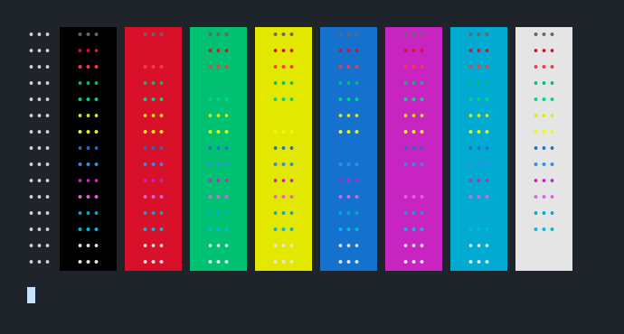

<details>
    <summary>Colors, click me</summary>

|  Color   |  Hex  |                               Preview                                |
|----------|:-----:|:--------------------------------------------------------------------:|
|background|#24292e||
|cursor    |#c8e1ff||
|foreground|#c9d1d9||
|color0    |#586069||
|color1    |#ea4a5a||
|color10   |#85e89d||
|color11   |#ffea7f||
|color12   |#79b8ff||
|color13   |#b392f0||
|color14   |#55d4dd||
|color15   |#fafbfc||
|color2    |#34d058||
|color3    |#ffea7f||
|color4    |#2188ff||
|color5    |#b392f0||
|color6    |#39c5cf||
|color7    |#d1d5da||
|color8    |#959da5||
|color9    |#f97583||


</details>

### Spaceduck

[Reference](https://github.com/pineapplegiant/spaceduck)

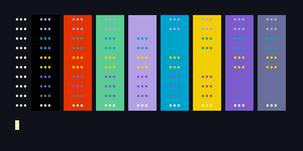

<details>
    <summary>Colors, click me</summary>

|  Color   |  Hex  |                               Preview                                |
|----------|:-----:|:--------------------------------------------------------------------:|
|background|#0f111b||
|foreground|#ecf0c1||
|cursor    |#ecf0c1||
|color0    |#000000||
|color1    |#e33400||
|color2    |#5ccc96||
|color3    |#b3a1e6||
|color4    |#00a3cc||
|color5    |#f2ce00||
|color6    |#7a5ccc||
|color7    |#686f9a||
|color8    |#686f9a||
|color9    |#e33400||
|color10   |#5ccc96||
|color11   |#b3a1e6||
|color12   |#00a3cc||
|color13   |#f2ce00||
|color14   |#7a5ccc||
|color15   |#f0f1ce||


</details>

### Horizon

[Reference](https://github.com/ntk148v/vim-horizon)

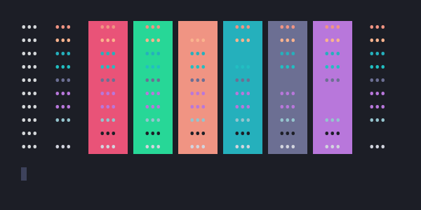

<details>
    <summary>Colors, click me</summary>

|  Color   |  Hex  |                               Preview                                |
|----------|:-----:|:--------------------------------------------------------------------:|
|background|#1c1e26||
|foreground|#d5d8da||
|cursor    |#3d425b||
|color0    |#1c1e26||
|color1    |#e95378||
|color2    |#27d797||
|color3    |#f09483||
|color4    |#25b0bc||
|color5    |#6c6f93||
|color6    |#b877db||
|color7    |#1c1e26||
|color8    |#6c6f93||
|color9    |#ec6a88||
|color10   |#6bdfe6||
|color11   |#fab38e||
|color12   |#21bfc2||
|color13   |#b877db||
|color14   |#95c4ce||
|color15   |#d2d4de||


</details>

### Juliana

[Reference](https://github.com/kaiuri/nvim-juliana/blob/master/extras/juliana_alacritty.yml)

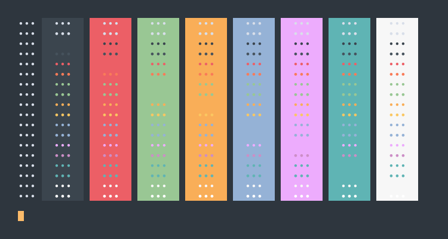

<details>
    <summary>Colors, click me</summary>

|  Color   |  Hex  |                               Preview                                |
|----------|:-----:|:--------------------------------------------------------------------:|
|background|#2e363e||
|cursor    |#fbbb6a||
|foreground|#d8dee9||
|color0    |#3b454e||
|color1    |#ec5f66||
|color2    |#99c794||
|color3    |#f9ae58||
|color4    |#95b2d6||
|color5    |#edacfd||
|color6    |#5fb4b4||
|color7    |#f7f7f7||
|color8    |#46525c||
|color9    |#f97b58||
|color10   |#99c794||
|color11   |#fac761||
|color12   |#95b2d6||
|color13   |#cc8ec6||
|color14   |#5fb4b4||
|color15   |#ffffff||


</details>

### Snazzy

[Reference](https://github.com/sindresorhus/iterm2-snazzy)

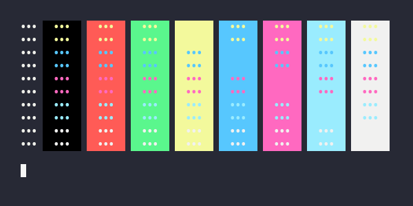

<details>
    <summary>Colors, click me</summary>

|  Color   |  Hex  |                               Preview                                |
|----------|:-----:|:--------------------------------------------------------------------:|
|background|#272935||
|cursor    |#e9e9e9||
|foreground|#eff0ea||
|color0    |#000000||
|color1    |#ff5b56||
|color10   |#5af78d||
|color11   |#f3f99c||
|color12   |#57c7fe||
|color13   |#ff69c0||
|color14   |#9aecfe||
|color15   |#f1f1f0||
|color2    |#5af78d||
|color3    |#f3f99c||
|color4    |#57c7fe||
|color5    |#ff69c0||
|color6    |#9aecfe||
|color7    |#f1f1f0||
|color8    |#686767||
|color9    |#ff5b56||


</details>

### Iceberg

[Reference](https://github.com/cocopon/iceberg.vim)

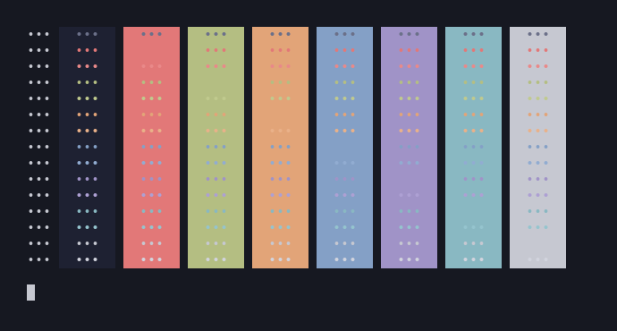

<details>
    <summary>Colors, click me</summary>

|  Color   |  Hex  |                               Preview                                |
|----------|:-----:|:--------------------------------------------------------------------:|
|background|#161821||
|foreground|#c6c8d1||
|cursor    |#c6c8d1||
|color0    |#1e2132||
|color1    |#e27878||
|color2    |#b4be82||
|color3    |#e2a478||
|color4    |#84a0c6||
|color5    |#a093c7||
|color6    |#89b8c2||
|color7    |#c6c8d1||
|color8    |#6b7089||
|color9    |#e98989||
|color10   |#c0ca8e||
|color11   |#e9b189||
|color12   |#91acd1||
|color13   |#ada0d3||
|color14   |#95c4ce||
|color15   |#d2d4de||


</details>

### Palenight

[Reference](https://github.com/JonathanSpeek/palenight-iterm2)

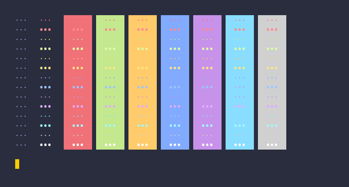

<details>
    <summary>Colors, click me</summary>

|  Color   |  Hex  |                               Preview                                |
|----------|:-----:|:--------------------------------------------------------------------:|
|background|#292d3e||
|cursor    |#ffcc00||
|foreground|#959dcb||
|color0    |#292d3e||
|color1    |#f07178||
|color2    |#c3e88d||
|color3    |#ffcb6b||
|color4    |#82aaff||
|color5    |#c792ea||
|color6    |#89ddff||
|color7    |#d0d0d0||
|color8    |#434758||
|color9    |#ff8b92||
|color10   |#ddffa7||
|color11   |#ffe585||
|color12   |#9cc4ff||
|color13   |#e1acff||
|color14   |#a3f7ff||
|color15   |#fefefe||


</details>

### Melange dark

[Reference](https://github.com/savq/melange)

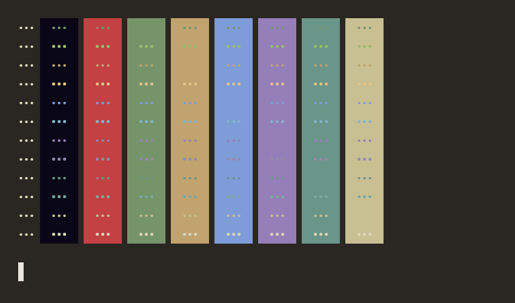

<details>
    <summary>Colors, click me</summary>

|  Color   |  Hex  |                               Preview                                |
|----------|:-----:|:--------------------------------------------------------------------:|
|background|#2a2622||
|cursor    |#ede6de||
|foreground|#ede6de||
|color0    |#38332e||
|color1    |#b34d4d||
|color10   |#94d194||
|color11   |#f7c96e||
|color12   |#94a8d1||
|color13   |#d194bd||
|color14   |#94d1d1||
|color15   |#ede6de||
|color2    |#669966||
|color3    |#f7c96e||
|color4    |#94a8d1||
|color5    |#ad85ad||
|color6    |#85adad||
|color7    |#c9b39c||
|color8    |#544d45||
|color9    |#f7856e||


</details>

### Github dark high contrast

[Reference](https://github.com/cdalvaro/github-vscode-theme-iterm)


<details>
    <summary>Colors, click me</summary>

|  Color   |  Hex  |                               Preview                                |
|----------|:-----:|:--------------------------------------------------------------------:|
|background|#010409||
|cursor    |#f0f3f6||
|foreground|#f0f3f6||
|color0    |#7a828e||
|color1    |#ff9492||
|color10   |#4ae168||
|color11   |#f7c843||
|color12   |#91cbff||
|color13   |#dbb7ff||
|color14   |#56d4dd||
|color15   |#ffffff||
|color2    |#26cd4d||
|color3    |#f0b72f||
|color4    |#71b7ff||
|color5    |#cb9eff||
|color6    |#39c5cf||
|color7    |#d9dee3||
|color8    |#9ea7b3||
|color9    |#ffb1af||


</details>

### Badwolf

[Reference](https://github.com/sjl/badwolf)


<details>
    <summary>Colors, click me</summary>

|  Color   |  Hex  |                               Preview                                |
|----------|:-----:|:--------------------------------------------------------------------:|
|background|#1c1b1a||
|foreground|#f8f6f2||
|cursor    |#f8f6f2||
|color0    |#1c1b1a||
|color1    |#ff2c4b||
|color2    |#8cffba||
|color3    |#f4cf86||
|color4    |#0a9dff||
|color5    |#ff9eb8||
|color6    |#ffa724||
|color7    |#e5e9f0||
|color8    |#4c566a||
|color9    |#ff2c4b||
|color10   |#8cffba||
|color11   |#f4cf86||
|color12   |#0a9dff||
|color13   |#ff9eb8||
|color14   |#fade3e||
|color15   |#ffffff||


</details>

### Urban

[Reference](https://github.com/divadretlaw/urban)

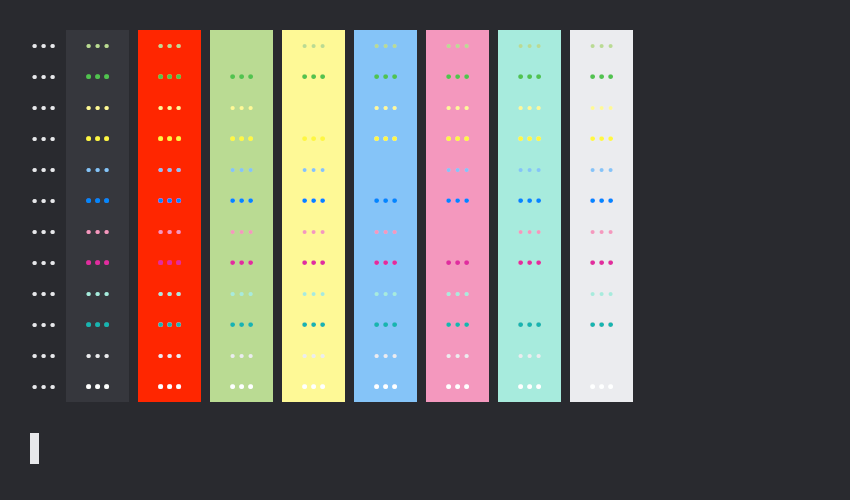

<details>
    <summary>Colors, click me</summary>

|  Color   |  Hex  |                               Preview                                |
|----------|:-----:|:--------------------------------------------------------------------:|
|background|#292a2f||
|cursor    |#e7e8eb||
|foreground|#e7e8eb||
|color0    |#36373d||
|color1    |#ff2600||
|color2    |#badb93||
|color3    |#fef996||
|color4    |#85c4f8||
|color5    |#f498be||
|color6    |#a7ebdd||
|color7    |#ebecef||
|color8    |#454957||
|color9    |#dd393b||
|color10   |#51c34f||
|color11   |#fef743||
|color12   |#0088ff||
|color13   |#e12ca0||
|color14   |#16b5b1||
|color15   |#feffff||


</details>

### Ayu dark

[Reference](https://github.com/dempfi/ayu)


<details>
    <summary>Colors, click me</summary>

|  Color   |  Hex  |                               Preview                                |
|----------|:-----:|:--------------------------------------------------------------------:|
|background|#0a0e14||
|cursor    |#ffcc66||
|foreground|#b3b1ad||
|color0    |#02060d||
|color1    |#f07178||
|color2    |#c2d94c||
|color3    |#ffb454||
|color4    |#59c2ff||
|color5    |#ffee99||
|color6    |#95e6cb||
|color7    |#c7c7c7||
|color8    |#686868||
|color9    |#f07178||
|color10   |#c2d94c||
|color11   |#ffb454||
|color12   |#59c2ff||
|color13   |#ffee99||
|color14   |#95e6cb||
|color15   |#ffffff||


</details>

### Srcery

[Reference](https://github.com/srcery-colors/srcery-vim)

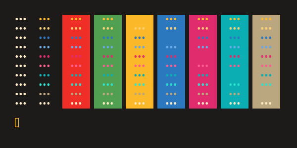

<details>
    <summary>Colors, click me</summary>

|  Color   |  Hex  |                               Preview                                |
|----------|:-----:|:--------------------------------------------------------------------:|
|background|#1c1b19||
|foreground|#fce8c3||
|cursor    |#fbb829||
|color0    |#1c1b19||
|color1    |#ef2f27||
|color2    |#519f50||
|color3    |#fbb829||
|color4    |#2c78bf||
|color5    |#e02c6d||
|color6    |#0aaeb3||
|color7    |#baa67f||
|color8    |#918175||
|color9    |#f75341||
|color10   |#98bc37||
|color11   |#fed06e||
|color12   |#68a8e4||
|color13   |#ff5c8f||
|color14   |#2be4d0||
|color15   |#fce8c3||


</details>

### Catppuccin

[Reference](https://github.com/catppuccin/catppuccin)

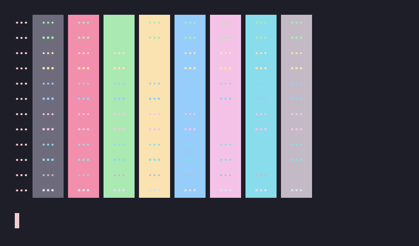

<details>
    <summary>Colors, click me</summary>

|  Color   |  Hex  |                               Preview                                |
|----------|:-----:|:--------------------------------------------------------------------:|
|background|#1e1e29||
|foreground|#f2cdcd||
|cursor    |#f2cdcd||
|color0    |#6e6c7c||
|color1    |#f28fad||
|color2    |#abe9b3||
|color3    |#fae3b0||
|color4    |#96cdfb||
|color5    |#f5c2e7||
|color6    |#89dceb||
|color7    |#c3bac6||
|color8    |#988ba2||
|color9    |#f28fad||
|color10   |#abe9b3||
|color11   |#fae3b0||
|color12   |#96cdfb||
|color13   |#f5c2e7||
|color14   |#89dceb||
|color15   |#d9e0ee||


</details>

### Spacecamp

[Reference](https://github.com/jaredgorski/SpaceCamp)

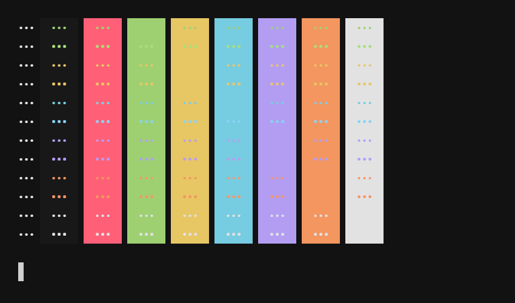

<details>
    <summary>Colors, click me</summary>

|  Color   |  Hex  |                               Preview                                |
|----------|:-----:|:--------------------------------------------------------------------:|
|background|#121212||
|foreground|#d0d0d0||
|cursor    |#d0d0d0||
|color0    |#282828||
|color1    |#d71a1a||
|color2    |#57ba37||
|color3    |#f0d50c||
|color4    |#91aadf||
|color5    |#cf73e6||
|color6    |#b7cbf4||
|color7    |#dedede||
|color8    |#666666||
|color9    |#ff0000||
|color10   |#d8fa3b||
|color11   |#e7c547||
|color12   |#b7cbf4||
|color13   |#b77ee0||
|color14   |#a9c1de||
|color15   |#eeeeee||


</details>

### Candid

[Reference](https://github.com/flrnd/candid.vim)

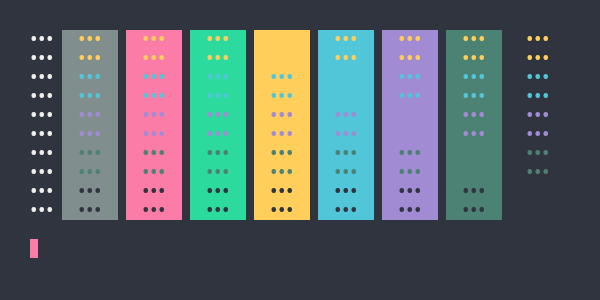

<details>
    <summary>Colors, click me</summary>

|  Color   |  Hex  |                               Preview                                |
|----------|:-----:|:--------------------------------------------------------------------:|
|background|#2f343f||
|foreground|#efeeea||
|cursor    |#fb7da7||
|color0    |#818e8e||
|color1    |#fb7da7||
|color2    |#2cda9d||
|color3    |#ffce5b||
|color4    |#50c6d8||
|color5    |#a18bd3||
|color6    |#4c8273||
|color7    |#2f343f||
|color8    |#818e8e||
|color9    |#fb7da7||
|color10   |#2cda9d||
|color11   |#ffce5b||
|color12   |#50c6d8||
|color13   |#a18bd3||
|color14   |#4c8273||
|color15   |#2f343f||


</details>

### Xcodedark

[Reference](https://github.com/arzg/vim-colors-xcode)

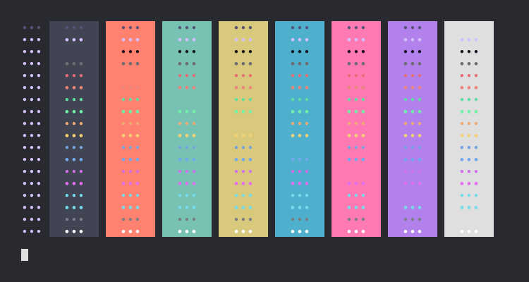

<details>
    <summary>Colors, click me</summary>

|  Color   |  Hex  |                               Preview                                |
|----------|:-----:|:--------------------------------------------------------------------:|
|background|#292a30||
|cursor    |#dfdfe0||
|foreground|#dfdfe0||
|color0    |#414453||
|color1    |#ff8170||
|color10   |#acf2e4||
|color11   |#ffa14f||
|color12   |#6bdfff||
|color13   |#ff7ab2||
|color14   |#dabaff||
|color15   |#dfdfe0||
|color2    |#78c2b3||
|color3    |#d9c97c||
|color4    |#4eb0cc||
|color5    |#ff7ab2||
|color6    |#b281eb||
|color7    |#dfdfe0||
|color8    |#7f8c98||
|color9    |#ff8170||


</details>

### Hackthebox

[Reference](https://github.com/silofy/hackthebox)

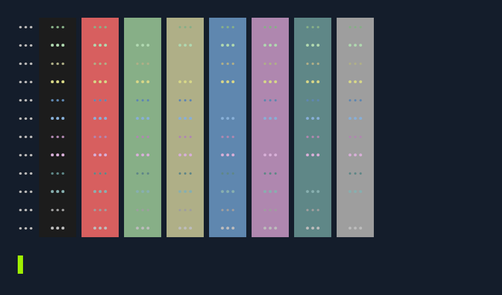

<details>
    <summary>Colors, click me</summary>

|  Color   |  Hex  |                               Preview                                |
|----------|:-----:|:--------------------------------------------------------------------:|
|background|#141d2b||
|foreground|#a4b1cd||
|cursor    |#9fef00||
|color0    |#111927||
|color1    |#ff3e3e||
|color2    |#9fef00||
|color3    |#ffaf00||
|color4    |#2e6cff||
|color5    |#cf8dfb||
|color6    |#5cecc6||
|color7    |#dee1e6||
|color8    |#313f55||
|color9    |#ff8484||
|color10   |#c5f467||
|color11   |#ffcc5c||
|color12   |#5cb2ff||
|color13   |#c68aee||
|color14   |#5cecc6||
|color15   |#a4b1cd||


</details>

### Github dark colorblind

[Reference](https://github.com/projekt0n/github-nvim-theme)

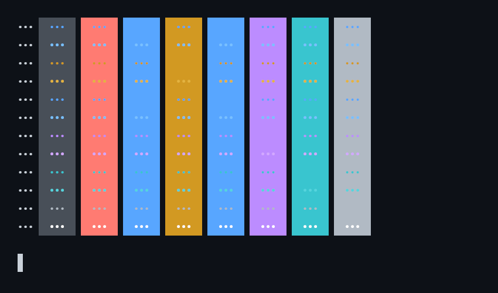

<details>
    <summary>Colors, click me</summary>

|  Color   |  Hex  |                               Preview                                |
|----------|:-----:|:--------------------------------------------------------------------:|
|background|#0c1116||
|cursor    |#73b7f2||
|foreground|#c9d1d9||
|color0    |#484f58||
|color1    |#ff7b72||
|color10   |#55d363||
|color11   |#e3b341||
|color12   |#79c0ff||
|color13   |#d2a8ff||
|color14   |#55d4dd||
|color15   |#f0f6fc||
|color2    |#3fb950||
|color3    |#d29921||
|color4    |#58a6ff||
|color5    |#bc8cff||
|color6    |#39c5cf||
|color7    |#b1bac4||
|color8    |#6e7681||
|color9    |#ffa198||


</details>

### One half dark

[Reference](https://github.com/sonph/onehalf)

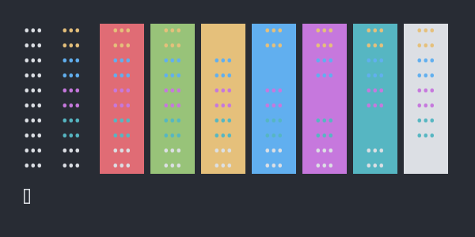

<details>
    <summary>Colors, click me</summary>

|  Color   |  Hex  |                               Preview                                |
|----------|:-----:|:--------------------------------------------------------------------:|
|background|#282c34||
|foreground|#dcdfe4||
|cursor    |#dcdfe4||
|color0    |#282c34||
|color1    |#e06c75||
|color2    |#98c379||
|color3    |#e5c07b||
|color4    |#61afef||
|color5    |#c678dd||
|color6    |#56b6c2||
|color7    |#dcdfe4||
|color8    |#61afef||
|color9    |#e06c75||
|color10   |#98c379||
|color11   |#e5c07b||
|color12   |#61afef||
|color13   |#c678dd||
|color14   |#56b6c2||
|color15   |#dcdfe4||


</details>

### Darker monokai

[Reference](https://github.com/ntk148v/vscode-darker-monokai)

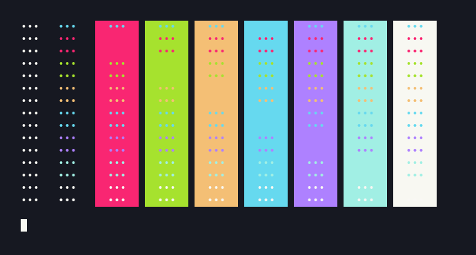

<details>
    <summary>Colors, click me</summary>

|  Color   |  Hex  |                               Preview                                |
|----------|:-----:|:--------------------------------------------------------------------:|
|background|#161821||
|foreground|#f8f8f2||
|cursor    |#f8f8f2||
|color0    |#161821||
|color1    |#f92672||
|color2    |#a6e22e||
|color3    |#f4bf75||
|color4    |#66d9ef||
|color5    |#ae81ff||
|color6    |#a1efe4||
|color7    |#f8f8f2||
|color8    |#66d9ef||
|color9    |#f92672||
|color10   |#a6e22e||
|color11   |#f4bf75||
|color12   |#66d9ef||
|color13   |#ae81ff||
|color14   |#a1efe4||
|color15   |#f9f8f5||


</details>

### Rose pine

[Reference](https://github.com/rose-pine)

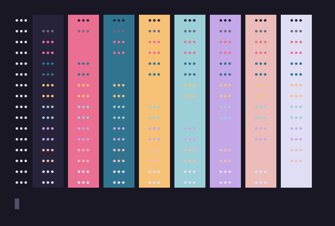

<details>
    <summary>Colors, click me</summary>

|  Color   |  Hex  |                               Preview                                |
|----------|:-----:|:--------------------------------------------------------------------:|
|background|#191724||
|foreground|#e0def4||
|cursor    |#524f67||
|color0    |#26233a||
|color1    |#eb6f92||
|color2    |#31748f||
|color3    |#f6c177||
|color4    |#9ccfd8||
|color5    |#c4a7e7||
|color6    |#ebbcba||
|color7    |#e0def4||
|color8    |#6e6a86||
|color9    |#eb6f92||
|color10   |#31748f||
|color11   |#f6c177||
|color12   |#9ccfd8||
|color13   |#c4a7e7||
|color14   |#ebbcba||
|color15   |#e0def4||


</details>

### Xcodedarkhc

[Reference](https://github.com/arzg/vim-colors-xcode)

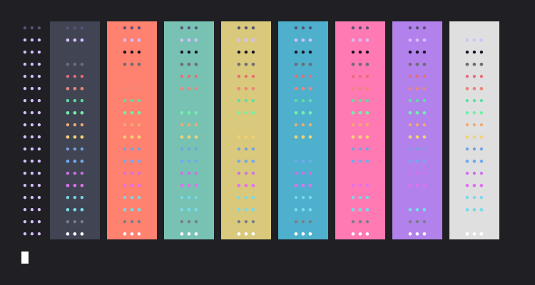

<details>
    <summary>Colors, click me</summary>

|  Color   |  Hex  |                               Preview                                |
|----------|:-----:|:--------------------------------------------------------------------:|
|background|#1f1f24||
|cursor    |#ffffff||
|foreground|#ffffff||
|color0    |#43454b||
|color1    |#ff8a7a||
|color10   |#b1faeb||
|color11   |#ffa14f||
|color12   |#6bdfff||
|color13   |#ff85b8||
|color14   |#e5cfff||
|color15   |#ffffff||
|color2    |#83c9bc||
|color3    |#d9c668||
|color4    |#4ec4e6||
|color5    |#ff85b8||
|color6    |#cda1ff||
|color7    |#ffffff||
|color8    |#838991||
|color9    |#ff8a7a||


</details>

### Moonfly

[Reference](https://github.com/bluz71/vim-moonfly-colors)

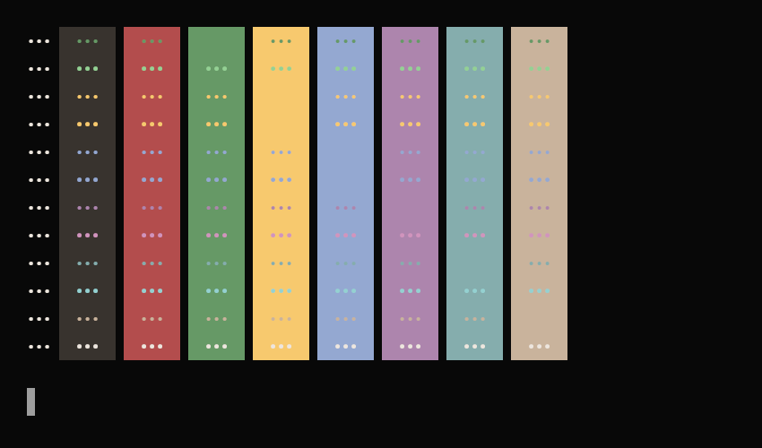

<details>
    <summary>Colors, click me</summary>

|  Color   |  Hex  |                               Preview                                |
|----------|:-----:|:--------------------------------------------------------------------:|
|background|#080808||
|foreground|#b2b2b2||
|cursor    |#9e9e9e||
|color0    |#323437||
|color1    |#ff5454||
|color2    |#8cc85f||
|color3    |#e3c78a||
|color4    |#80a0ff||
|color5    |#d183e8||
|color6    |#79dac8||
|color7    |#c6c6c6||
|color8    |#323437||
|color9    |#ff5189||
|color10   |#36c692||
|color11   |#c2c292||
|color12   |#74b2ff||
|color13   |#ae81ff||
|color14   |#85dc85||
|color15   |#e4e4e4||


</details>

### Rose pine moon

[Reference](https://github.com/rose-pine)

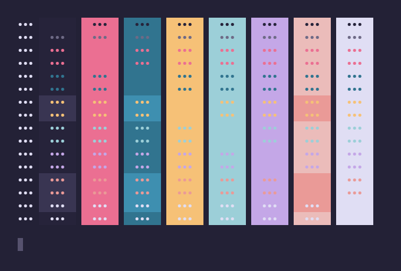

<details>
    <summary>Colors, click me</summary>

|  Color   |  Hex  |                               Preview                                |
|----------|:-----:|:--------------------------------------------------------------------:|
|background|#232136||
|foreground|#e0def4||
|cursor    |#56526e||
|color0    |#393552||
|color1    |#eb6f92||
|color2    |#3e8fb0||
|color3    |#f6c177||
|color4    |#9ccfd8||
|color5    |#c4a7e7||
|color6    |#ea9a97||
|color7    |#e0def4||
|color8    |#393552||
|color9    |#eb6f92||
|color10   |#3e8fb0||
|color11   |#f6c177||
|color12   |#9ccfd8||
|color13   |#c4a7e7||
|color14   |#ea9a97||
|color15   |#e0def4||


</details>

